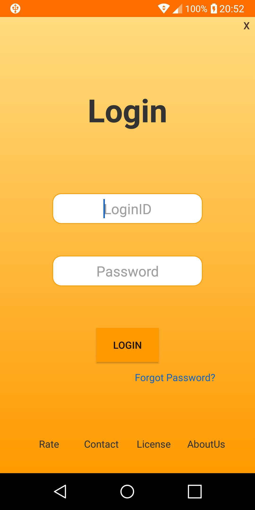
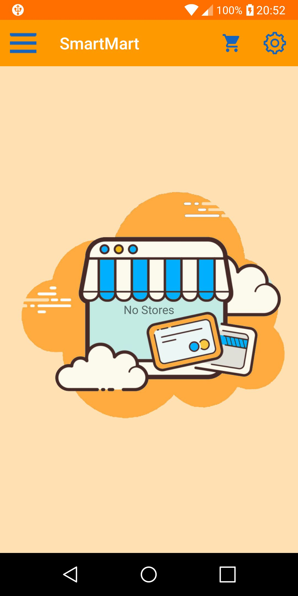
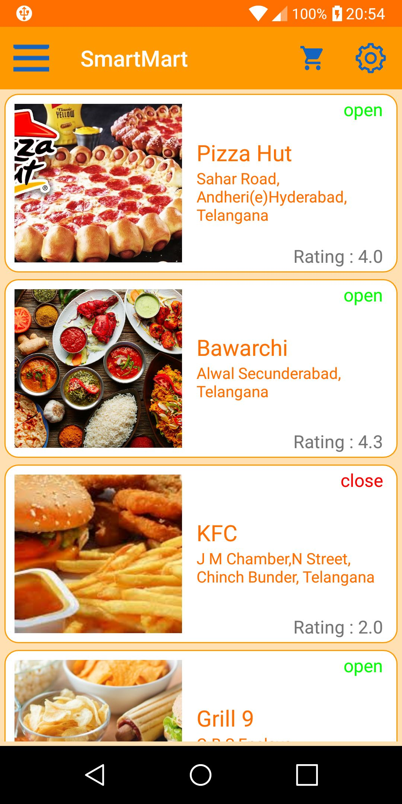
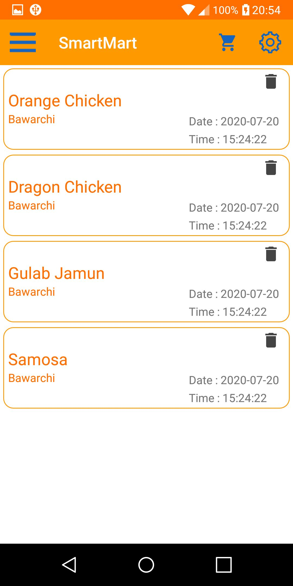
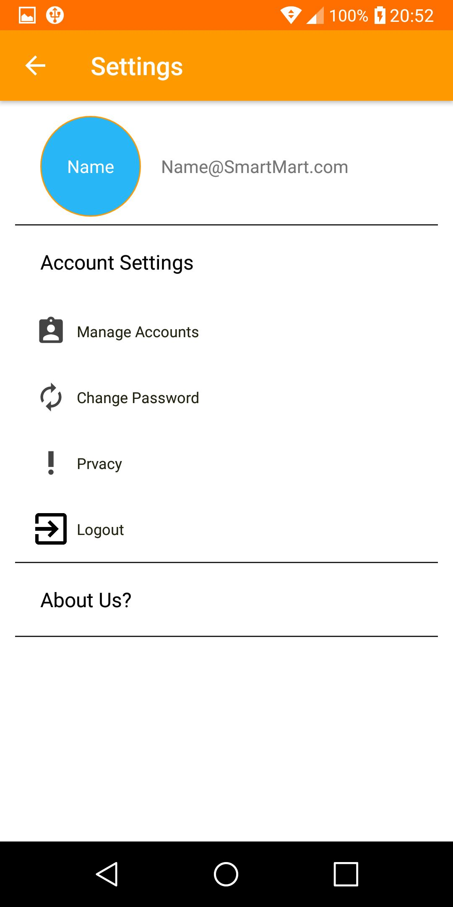

# Online-Food-Ordering-App
Food Ordering app:Front End Java (Android Studio) and Backend Java(Spring Boot)

**To Connect Backend to Frontend change the "Base Url" in the StoreController.java in "SmartMart001/app/src/main/java/com/example/smartmart001/Controller/StoreController.java" 
to the "ip in which the Server runs".(in my case its "192.168.42.70");

** Change the Path of file.upload-dir in "smartmart/src/main/resources/application.properties" to the path of the images folder in the repo

Login Screen:

Empty StoreView:

Store View:

History View:

Setting View:

